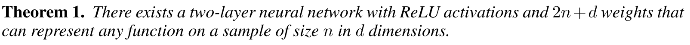
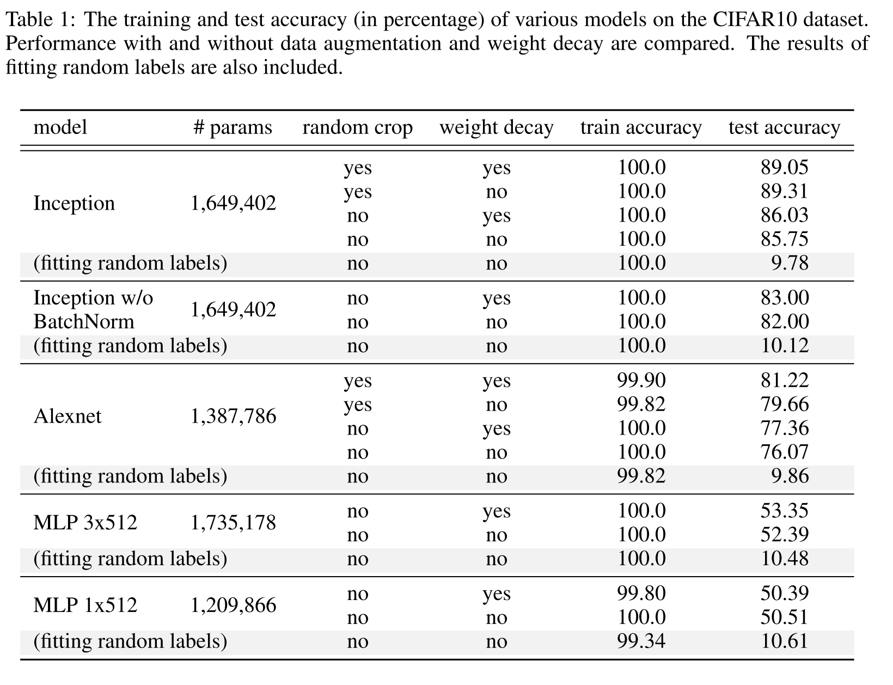

# ICLR 17 [best paper]: Understanding Deep Learning Requires Rethinking Generalization

[Paper](https://arxiv.org/abs/1611.03530)
## Introductions
- Generalization error : Training Error - Test Error.
- Large DNN has small generalization error.
- Generalization is incapable of distinguishing between different neural networks that have actually radically different generalization performance.
- The paper evaluates why some NN are capable of small generalization error while others not.
- Measures to evaluate GE :
  - VC Dimension (Vapnik’98)
  - Rademacher complexity (Barlett&Mendelson, 2003)
  - Uniform Stability(Mukherjee 2003)

----------
## Contributions

This paper talks about several inference under following themes

- Randomization Tests
- Role of explicit regularization
- Finite sample expressivity
- Role of Implicit Regularization
----------
## Randomization Tests
- **Deep nn easily fit random labels.** By randomizing labels alone we can force the generalization error of a model to jump up considerably without changing the model, it size, hyper parameters or the optimizer. ****
- Observations:
  - effective capacity is sufficient to learn all dataset.
  - Optimization on random label stays easy.
  - No significant increase in training time.
  - this is similar as data transformation
- Replacing true images with random pixels keeps training accuracy same.
- CNNs can fit random noise
- As noise increases, accuracy steadily decreases. This shows it fits all the parts on images noise and signal.
----------
## Role of explicit regularization
- Some of the regularization technique used are weight decay, dropout and data augmentation.
- **Explicit Regularization may improve performance but is not sufficient or necessary condition for controlling generalization error.**
- This is different from usual convex optimization techniques where regularizer play significant role in convergence.
- Absence of regularizer may not change generalization error.
----------
## Finite Sample Expressivity
- large neural networks can express any size of training sample, as long as number of parameters are more than $2n+d$ .

- they show that with 2-depth network of sufficient parameter size can learn any training sample.
----------
## Role of Implicit Generalization
- Models that has low training error may not have low generalization error.
- In linear models, SGD pays the role of implicit regularizer and always approach to minima within a norm.
- In Deep NN, model trained by SGD still need to be analyzed for their properties.
----------

